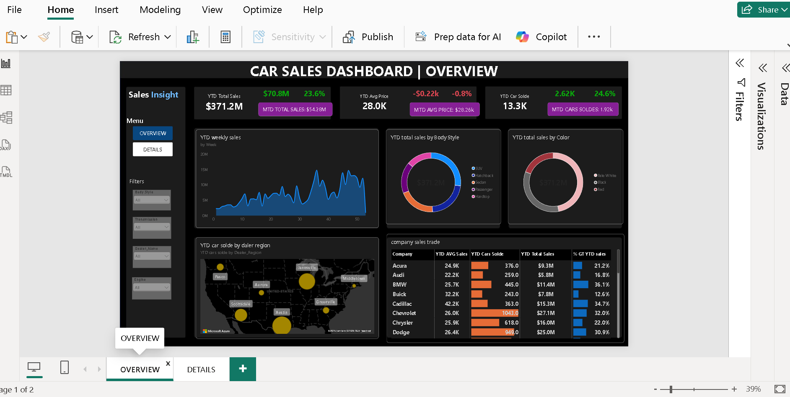

# Car Sales Performance Dashboard

**Power BI portfolio project | Sales analytics | 2022–2023**

I turned **23,906 car sales transactions** into an interactive report that tracks performance over time and lets a dealership investigate what drives it. This project showcases my work with **DAX, date and time intelligence, KPI development, and Power BI report design**.

## What I achieved

- Built a **two-page Power BI report** that moves from an executive overview to transaction-level details.
- Created a KPI framework for **sales revenue, average selling price, and cars sold**, with YTD, MTD, YoY, and prior-year comparisons.
- Made performance explorable by **week, company, body style, color, and dealer region** instead of leaving it as a single total.
- Added **four slicers on each page** and page navigation so users can investigate a specific dealer or vehicle segment.
- Used the analysis to identify a concrete result: **2023 sales increased 23.6% while average selling price fell 0.8%**, indicating that higher sales volume drove revenue growth.

## The business problem

The dealership needed a way to monitor sales without working through individual spreadsheet rows. The project requirements called for year-to-date (YTD), month-to-date (MTD), and year-over-year (YoY) views of **revenue, average selling price, and cars sold**, plus charts that reveal sales patterns and a table for detailed investigation.

## What I built

| Report page | Purpose |
| --- | --- |
| **OVERVIEW** | Tracks the three main KPIs and their comparisons. A weekly trend shows when sales changed; donut charts show the mix by body style and color; an Azure map shows cars sold by dealer region; and a company table compares sales, average price, volume, and growth. |
| **DETAILS** | Lets users inspect individual sales, including the date, company, model, body style, color, dealer region, customer, and price. The main KPIs remain visible for context. |

Both pages have navigation and slicers for **body style, transmission, dealer name, and engine**. Selecting a segment lets users examine the same measures from a different angle without rebuilding the report.

## Technical skills demonstrated

| Skill | How I applied it in this project |
| --- | --- |
| **DAX measures** | Defined reusable measures for total sales, average selling price, cars sold, growth rates, and differences from the prior-year period. |
| **Date and time intelligence** | Calculated YTD and MTD performance, compared YTD results with the prior-year period, and calculated YoY changes. The weekly trend adds a shorter-term view of when sales rise or fall. |
| **KPI design** | Presented revenue, price, and volume together so a change in sales can be understood through both units sold and selling price. |
| **Filter context and interactivity** | Used slicers for body style, transmission, dealer, and engine to let users explore the measures for selected segments. |
| **Data visualization** | Used cards for headline numbers, an area chart for the weekly trend, donut charts for product mix, a map for regional volume, and tables for comparison and detail. |
| **Report structure** | Designed an OVERVIEW page for quick monitoring and a DETAILS page for checking the underlying sales records. |

The PBIX contains the DAX measures used by these visuals. The source data is a single `car_data` sheet, so this project is strongest evidence of **measure writing, time-based analysis, and report building**.

## A few findings from the source data

The workbook contains **23,906 sales records** from **January 2, 2022 through December 31, 2023**. A check of the unfiltered source data shows:

| Measure | 2022 | 2023 | Change |
| --- | ---: | ---: | ---: |
| Sales | $300.3M | $371.2M | +23.6% |
| Cars sold | 10,645 | 13,261 | +24.6% |
| Average selling price | $28.2K | $28.0K | −0.8% |

Sales grew mainly through **higher vehicle volume**, while average selling price edged down. Across the full two-year dataset, **SUVs generated the most sales revenue** at about **$170.6M**. These are observations from the supplied workbook; dashboard values change with the selected filters.

## Data and files

The source is the `car_data` sheet in [`Car Sales.xlsx`](Car%20Sales.xlsx). It includes a unique car ID per record, sale date, price, car attributes, dealership information, and customer fields.

| File | Description |
| --- | --- |
| [`car_sales_dashboard.pbix`](car_sales_dashboard.pbix) | Power BI report and model |
| [`Car Sales.xlsx`](Car%20Sales.xlsx) | Source workbook |
| `overview.png` | Screenshot shown above |
| `Car Sales Background 1.jpg`, `Car Sales Background 2.jpg` | Custom page backgrounds |

## Open the dashboard

1. Keep the PBIX and Excel workbook in a local folder.
2. Open `car_sales_dashboard.pbix` in Power BI Desktop.
3. If prompted, point the report's Excel data source to your local `Car Sales.xlsx` file and refresh.
4. Use the **OVERVIEW** and **DETAILS** pages, then try the slicers to explore different sales segments.

The supplied data is historical, so the report does not claim a live or real-time feed. The workbook also contains customer names and phone numbers; anonymize those fields before publishing the raw data or transaction-level exports.
